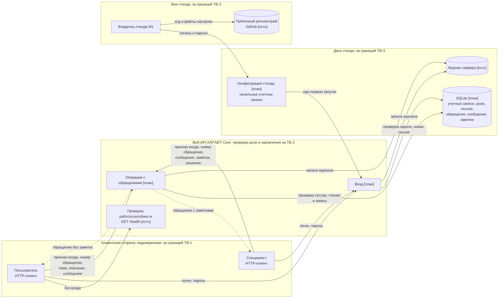

# Модель угроз

## Модель продукта

Компоненты и взаимодействия взяты из [PROJECT.md, раздел 6](../PROJECT.md#6-компоненты-и-внешние-взаимодействия), требуемые свойства описаны в [требованиях безопасности](security-requirements.md).

Сплошные стрелки показывают запросы и запись данных, пунктирные показывают ответы API клиенту. Границы доверия TB-1, TB-2 и TB-3 описаны в разделе «Границы доверия». Вход выдает клиенту признак входа, который клиент передает в следующих запросах.

**Точки входа.** Пути API планируемые и могут уточниться при реализации. В колонке «Штатный участник» указано, кто вызывает операцию в сценариях продукта; технически любую точку входа может вызвать любой клиент.

| Точка входа | Штатный участник | Данные от клиента | Что меняется |
| --- | --- | --- | --- |
| `GET /health` [есть] | любой клиент | нет | ничего |
| `POST /auth/login` | пользователь, специалист | логин, пароль | выдается признак входа |
| `GET /tickets` | пользователь, специалист | признак входа, параметры запроса | ничего |
| `POST /tickets` | пользователь | признак входа, тема, описание | новое обращение |
| `GET /tickets/{id}` | пользователь, специалист | признак входа, номер | ничего |
| `POST /tickets/{id}/messages` | пользователь, специалист | признак входа, номер, текст | новое сообщение |
| `POST /tickets/{id}/notes` | специалист | признак входа, номер, текст | новая заметка |
| `POST /tickets/{id}/take` | специалист | признак входа, номер | состояние, ответственный |
| `POST /tickets/{id}/close` | специалист | признак входа, номер, решение | состояние, решение |
| `POST /tickets/{id}/reopen` | пользователь | признак входа, номер, комментарий | состояние, новое сообщение |

**Что уже существует:** веб-API на ASP.NET Core с `GET /health` (commit `4168a82`), запуск стенда в окружении `Development` (`launchSettings.json`), журнал сервера в консоли, публичный репозиторий проекта с файлами настроек `appsettings*.json`.

**Что пока планируется:** вход по учебной учетной записи с серверной сессией (D-01), операции с обращениями, хранилище SQLite, создание начальных учетных записей из секретов пользователя или переменных окружения стенда (D-04).

**Существенные допущения:**

- А1. Стенд учебный и локальный: сервер слушает только `localhost`, трафик не выходит за пределы компьютера, поэтому используется HTTP без шифрования.
- А2. Клиенты разных пользователей и специалистов рассматриваются как независимые стороны, даже если на стенде они запускаются на одном компьютере.
- А3. Владелец стенда и его компьютер доверенные. Владелец имеет прямой доступ к файлам стенда и как нарушитель не рассматривается.
- А4. Учетные записи создаются только из конфигурации стенда, самостоятельной регистрации нет.
- А5. Признак входа приходит от клиента и считается недоверенным вводом, пока сервер его не проверил. Выбранный механизм (серверная сессия) описан в D-01.
- А6. Заметки передаются специалисту в составе ответа на запрос обращения ([допущения требований](security-requirements.md#обозначения-и-допущения)).

## Границы доверия

| Граница | Что пересекает | Почему требуется проверка |
| --- | --- | --- |
| TB-1. HTTP-клиент → веб-API | данные входа, признак входа, номер обращения, тексты, любые дополнительные поля запроса, например автор или роль | Клиент формирует запрос сам и может изменить в нем любое значение. Сервер не считает номер обращения, автора или роль из запроса допустимыми и сам определяет, кто отправил запрос и что ему разрешено |
| TB-2. Роль пользователя → операции специалиста; специалист → обращение другого ответственного | вызовы взятия в работу, добавления заметки и закрытия; номер обращения | Внутри одного API меняется набор допустимых действий. Выполненный вход не делает операцию допустимой: роль и назначение проверяются на сервере для каждой операции |
| TB-3. Веб-API → файлы стенда и публичный репозиторий | сохраненные данные учетных записей, записи журнала, файлы настроек с начальными учетными записями | Чтение файлов и репозитория идет в обход проверок API. Записанное в эти файлы видит любой, у кого есть к ним доступ, а репозиторий открыт всем |

## Значимые объекты и свойства

Объекты и последствия нарушения описаны в [PROJECT.md, раздел 5](../PROJECT.md#5-значимые-данные-и-другие-объекты), требуемые свойства в [требованиях безопасности](security-requirements.md):

- обращения и переписка: конфиденциальность между пользователями, целостность переписки;
- внутренние заметки: конфиденциальность от пользователей;
- состояние, ответственный и решение: целостность и соблюдение полномочий;
- учетные записи, роли и сессии: подлинность субъекта, конфиденциальность паролей и идентификаторов сессий.

## Угрозы

| ID | Коротко | Связанные SR | Приоритет |
| --- | --- | --- | --- |
| T-01 | Чужое обращение по подставленному номеру | SR-01 | высокий |
| T-02 | Заметки в ответе пользователю по его обращению | SR-02 | высокий |
| T-03 | Пользователь выполняет операции специалиста | SR-03 | высокий |
| T-04 | Специалист изменяет обращение другого ответственного | SR-04 | средний |
| T-05 | Подмена автора записи через данные запроса | SR-05 | средний |
| T-06 | Операции с обращениями без входа или с подделанным признаком | SR-06 | высокий |
| T-07 | Подбор пароля специалиста | SR-06, частично | низкий |
| T-08 | Пароли учетных записей в репозитории или журнале | SR-07 | средний |
| T-09 | Перегрузка сервиса большими текстами | нет | низкий |
| T-10 | Использование чужого идентификатора сессии | нет | низкий |

### T-01. Пользователь работает с чужим обращением по подставленному номеру

- **Сценарий:** пользователь B меняет номер обращения в запросе просмотра, сообщения или повторного открытия на номер обращения пользователя A либо указывает автора A в параметрах запроса списка и читает переписку A, пишет в нее или узнает состояние обращения.
- **Нарушаемое свойство:** конфиденциальность обращения и переписки; при записи целостность переписки и состояния.
- **Последствие:** B узнает подробности проблемы A и сведения о нем; в переписке A появляются чужие сообщения, закрытое обращение A открывается без его ведома.
- **Граница и точка входа:** TB-1; `GET /tickets`, `GET /tickets/{id}`, `POST /tickets/{id}/messages`, `POST /tickets/{id}/reopen`.
- **Связанные SR:** SR-01.
- **Приоритет:** высокий. Угроза относится к основному сценарию, для попытки достаточно изменить число в адресе запроса, а пострадать может каждый пользователь.

### T-02. Заметки попадают в ответ пользователю по его обращению

- **Сценарий:** пользователь A законно запрашивает свое обращение или список своих обращений, пишет сообщение или получает ответ об ошибке и видит в ответе внутренние заметки специалистов, их авторов и время. Злой умысел не нужен: событие возникает при обычной работе, если состав ответа не зависит от роли получателя.
- **Нарушаемое свойство:** конфиденциальность заметок.
- **Последствие:** пользователь видит служебную оценку и детали диагностики, не предназначенные ему.
- **Граница и точка входа:** TB-1, поток «обращение без заметок» от API к пользователю; `GET /tickets/{id}`, `GET /tickets`, ответы `POST /tickets/{id}/messages` и `POST /tickets/{id}/reopen`, ответы об ошибках.
- **Связанные SR:** SR-02.
- **Приоритет:** высокий. Ответ по своему обращению получает каждый пользователь в основном сценарии, и ограничение по автору обращения (SR-01) эту угрозу не останавливает.

### T-03. Пользователь выполняет операции специалиста

- **Сценарий:** пользователь напрямую отправляет запрос на взятие в работу, добавление заметки или закрытие своего обращения, при необходимости указав в запросе роль специалиста.
- **Нарушаемое свойство:** соблюдение полномочий; целостность состояния, заметок и решения.
- **Последствие:** обращение закрыто без решения специалиста и выпадает из очереди; среди заметок появляется текст пользователя, который специалисты примут за служебный.
- **Граница и точка входа:** TB-1, TB-2; `POST /tickets/{id}/take`, `POST /tickets/{id}/notes`, `POST /tickets/{id}/close`.
- **Связанные SR:** SR-03.
- **Приоритет:** высокий. Отсутствие кнопки в клиенте не мешает отправить запрос, а нарушение дает пользователю действия другой роли во всех его обращениях.

### T-04. Специалист изменяет обращение другого ответственного

- **Сценарий:** специалист S2 отправляет сообщение, заметку, закрытие или повторное взятие в работу для обращения, назначенного S1.
- **Нарушаемое свойство:** соблюдение полномочий; целостность ответственного и решения.
- **Последствие:** обращение закрыто без участия ответственного или перехвачено; пользователь получает решение от того, кто проблему не разбирал.
- **Граница и точка входа:** TB-2; `POST /tickets/{id}/messages`, `POST /tickets/{id}/notes`, `POST /tickets/{id}/close`, `POST /tickets/{id}/take`.
- **Связанные SR:** SR-04.
- **Приоритет:** средний. Нужна учетная запись специалиста, а специалисты и так читают все обращения; посторонним данные не раскрываются.

### T-05. Подмена автора записи через данные запроса

- **Сценарий:** пользователь A добавляет в запрос создания обращения или сообщения поле автора с учетной записью B или специалиста; специалист S1 так же указывает S2 автором заметки или решения.
- **Нарушаемое свойство:** подлинность автора; подотчетность действий.
- **Последствие:** в списке B появляется обращение, которого он не создавал; в переписке появляется сообщение «от специалиста» с ложными указаниями; по заметке нельзя установить, кто ее написал.
- **Граница и точка входа:** TB-1; `POST /tickets`, `POST /tickets/{id}/messages`, `POST /tickets/{id}/notes`, `POST /tickets/{id}/close`.
- **Связанные SR:** SR-05.
- **Приоритет:** средний. Для попытки достаточно добавить поле в запрос, но последствия касаются достоверности отдельных записей, а не доступа к чужим данным.

### T-06. Операции с обращениями без входа или с подделанным признаком входа

- **Сценарий:** клиент без учетной записи отправляет запрос к операциям с обращениями без признака входа либо с признаком, который он изготовил или изменил сам.
- **Нарушаемое свойство:** подлинность субъекта, а через нее конфиденциальность и целостность всех данных продукта.
- **Последствие:** сервер не может определить автора и роль и применить SR-01–SR-05; посторонний читает и меняет обращения.
- **Граница и точка входа:** TB-1; все точки входа, кроме `GET /health` и `POST /auth/login`.
- **Связанные SR:** SR-06.
- **Приоритет:** высокий. Пропуск проверки в одной точке входа открывает данные любому, кто может отправить запрос, а на подлинности субъекта держатся остальные требования.

### T-07. Подбор пароля учетной записи специалиста

- **Сценарий:** нарушитель узнает логин специалиста из подписи ответа в своем обращении или перебором логинов и многократно отправляет запрос входа с этим логином, перебирая пароли.
- **Нарушаемое свойство:** подлинность субъекта.
- **Последствие:** вход с ролью специалиста, чтение всех обращений и заметок.
- **Граница и точка входа:** TB-1; `POST /auth/login`.
- **Связанные SR:** SR-06, частично: логины специалистов не раскрываются ни ответом на вход, ни ответами с данными обращений (уточнено после контрпримера, см. D-03). Ограничение числа попыток входа в требования не включено.
- **Приоритет:** низкий. При допущении А1 сервер доступен только с компьютера стенда, учебные пароли задает владелец. Приоритет не опирается на скрытость логина: в первой версии D-03 логин специалиста показывался бы любому пользователю, получившему ответ.
- **Условие пересмотра:** сервер становится доступен по сети. Тогда приоритет повышается и нужно отдельное SR на ограничение попыток входа.

### T-08. Пароли учетных записей попадают в репозиторий или журнал

- **Сценарий:** начальные логины и пароли записываются в файл настроек, который попадает в публичный репозиторий, или пароль из запроса входа оказывается в журнале сервера; посторонний читает их.
- **Нарушаемое свойство:** конфиденциальность данных входа.
- **Последствие:** вход от чужого имени, в том числе как специалист, и чтение чужих обращений и заметок. Пароль в истории репозитория остается доступным и после удаления файла.
- **Граница и точка входа:** TB-3; файлы `appsettings*.json`, журнал сервера, файл базы данных.
- **Связанные SR:** SR-07.
- **Приоритет:** средний. Ошибка вероятна: файлы настроек уже находятся в публичном репозитории (commit `4168a82`). Для входа с найденным паролем нужен доступ к стенду (А1).

### T-09. Перегрузка сервиса большими текстами

- **Сценарий:** вошедший пользователь создает обращения и сообщения с очень большими текстами или в большом количестве.
- **Нарушаемое свойство:** доступность.
- **Последствие:** растет файл базы, ответы замедляются, другие пользователи не получают ответов вовремя.
- **Граница и точка входа:** TB-1; `POST /tickets`, `POST /tickets/{id}/messages`.
- **Связанные SR:** нет. При допущениях А1 и А4 нарушитель должен иметь учебную учетную запись на локальном стенде, последствия ограничены одним стендом.
- **Приоритет:** низкий.
- **Условие пересмотра:** доступ по сети или открытая регистрация. Тогда нужно SR на ограничение размера и количества записей.

### T-10. Использование чужого идентификатора сессии

- **Сценарий:** посторонний получает действующий идентификатор сессии другого пользователя или специалиста из журнала, из копии файла базы или при передаче по сети и отправляет с ним запросы.
- **Нарушаемое свойство:** подлинность субъекта.
- **Последствие:** до истечения срока сессии посторонний действует с правами владельца идентификатора, в том числе читает заметки, если это сессия специалиста.
- **Граница и точка входа:** TB-1 (передача идентификатора), TB-3 (журнал и файл базы); все точки входа с проверкой сессии.
- **Связанные SR:** нет. SR-06 отклоняет поддельный и измененный признак, но не действующий чужой. D-01 частично уменьшает вероятность: идентификатор не пишется в журнал, срок сессии ограничен. Угроза появилась после выбора серверной сессии в D-01.
- **Приоритет:** низкий. При А1 трафик не покидает компьютер стенда, при А3 файлы стенда доступны только доверенному владельцу, срок сессии ограничен.
- **Условие пересмотра:** доступ по сети или хранение базы вне компьютера владельца. Тогда нужно SR на защиту идентификатора сессии при передаче и хранении.

### Рассмотренные и отклоненные кандидаты

| Кандидат | Решение | Условие пересмотра |
| --- | --- | --- |
| Перехват или изменение запросов и ответов при передаче по сети | отклонен: при А1 трафик не выходит за пределы компьютера стенда | сервер становится доступен по сети |
| Специалист отрицает, что закрыл обращение | объединен с T-05: автор решения сохраняется по SR-05, ответственный известен по SR-04 | появится переназначение обращений |
| Ответ об ошибке показывает клиенту подробности исключения, потому что стенд работает в окружении `Development` | объединен с T-02 в части данных обращения; общий ответ об ошибке задан в D-03 | клиенту понадобятся подробности ошибок |

## Приоритетный набор

**T-01, T-02, T-03, T-06.**

В набор вошли угрозы с высоким приоритетом. Они относятся к основным сценариям, возникают при простом изменении запроса или при обычной работе и ведут к раскрытию данных одного пользователя другому либо к действиям чужой роли. T-04, T-05 и T-08 остаются в модели со средним приоритетом: их последствия ограничены достоверностью отдельных записей или требуют доступа к стенду. T-07, T-09 и T-10 имеют низкий приоритет при допущениях А1 и А3, у каждой записано условие пересмотра.

Решения для приоритетного набора описаны в [проектных решениях](design-decisions.md): T-01 → D-02, T-02 → D-03, T-03 → D-01 и D-02, T-06 → D-01. Вне приоритетного набора решения есть для T-04 (D-02), T-05 (D-01) и T-08 (D-04).
